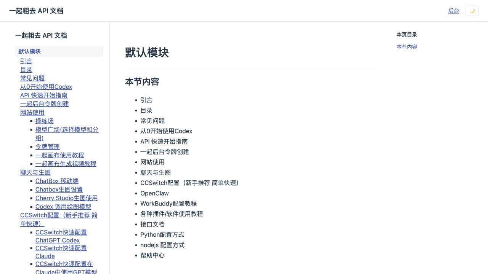
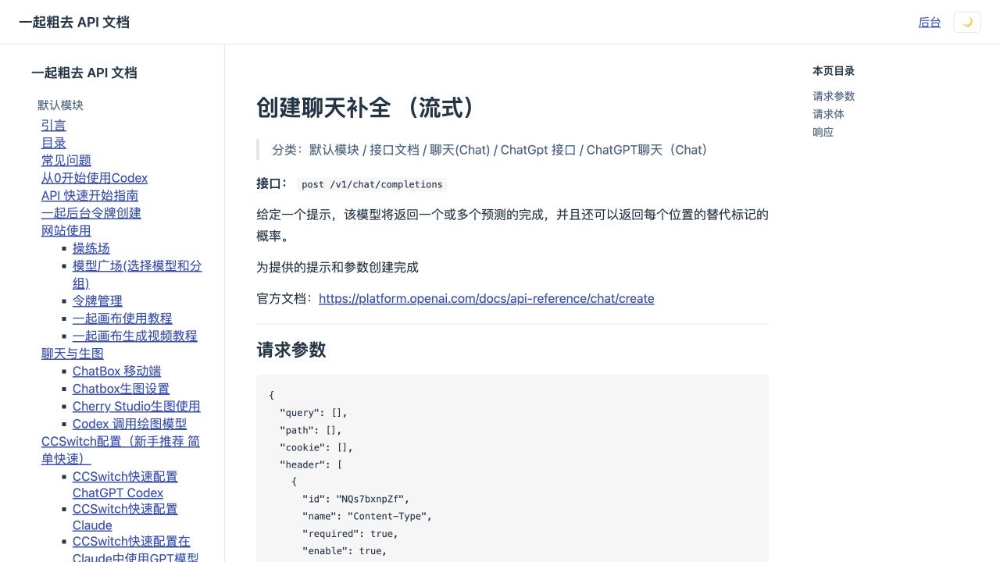

# Yiqi Docs

English | [简体中文](./README.zh-CN.md)

Yiqi Docs is a source-available, non-commercial documentation platform for Markdown-based product docs, API references, tutorials, and internal knowledge bases. It ships with a Go backend, a Vue admin console, a public documentation reader, SQLite storage, and a single-binary deployment flow.

## Screenshots

Public documentation overview:



API detail page:



## Features

- Multi-site docs: host multiple documentation sites by path, such as `/api-docs` and `/user-guide`.
- Tree-structured pages: unlimited nested pages with sidebar navigation and generated page paths.
- Markdown rendering: public pages render Markdown with code highlighting and table-of-contents extraction.
- Admin console: manage sites, pages, page order, users, and media uploads.
- Role-based access: `super_admin` can manage everything; `admin` can manage owned sites.
- SQLite by default: simple local deployment without an external database.
- Single-binary deploy: build the Vue frontend, embed it into the Go server, and run one executable.
- Optional scraper: seed docs from public or shared documentation sources.

## Tech Stack

Backend:

- Go
- Gin
- GORM
- SQLite
- JWT cookie authentication

Frontend:

- Vue 3
- Vite
- Pinia
- Vue Router
- Markdown-It
- Highlight.js
- md-editor-v3

## Repository Layout

```text
.
├── backend/
│   ├── cmd/
│   │   ├── server/      # HTTP server entrypoint
│   │   └── scrape/      # optional seed/scrape command
│   ├── internal/
│   │   ├── api/         # HTTP handlers and routes
│   │   ├── auth/        # password hashing and JWT
│   │   ├── config/      # environment config
│   │   ├── model/       # GORM models
│   │   ├── scraper/     # seeding and scraping helpers
│   │   └── store/       # data access layer
│   └── web/             # embedded frontend assets
├── frontend/
│   ├── src/
│   │   ├── api/         # API client and types
│   │   ├── components/  # docs layout components
│   │   ├── stores/      # Pinia stores
│   │   └── views/       # public and admin pages
├── docs/screenshots/    # README screenshots
└── build.sh             # production build script
```

## Requirements

- Go matching the version declared in `backend/go.mod`
- Node.js 20+ or 22+
- pnpm
- SQLite support through Go dependencies

Install pnpm if needed:

```bash
corepack enable
corepack prepare pnpm@latest --activate
```

## Quick Start

### 1. Clone

```bash
git clone https://github.com/mujiangliu/yiqi-docs.git
cd yiqi-docs
```

### 2. Start the Backend

```bash
cd backend
JWT_SECRET=change-me \
SEED_ADMIN_USER=admin \
SEED_ADMIN_PASS=change-me \
go run ./cmd/server
```

The backend listens on `http://localhost:8080` by default.

### 3. Start the Frontend Dev Server

Open another terminal:

```bash
cd frontend
pnpm install
pnpm dev
```

The frontend listens on `http://localhost:5173`. During development, Vite proxies `/api` to `http://localhost:8080`.

### 4. Open the App

- Public docs: `http://localhost:5173/<site-path>/`
- Admin console: `http://localhost:5173/admin`
- Default seed account, if created with the commands above:
  - Username: `admin`
  - Password: the value you set in `SEED_ADMIN_PASS`

## Runtime Configuration

| Variable | Default | Required | Description |
| --- | --- | --- | --- |
| `PORT` | `8080` | No | HTTP server port. |
| `DB_PATH` | `./data.db` | No | SQLite database file path. |
| `JWT_SECRET` | empty | Yes | Secret used to sign JWT cookies. |
| `SEED_ADMIN_USER` | `admin` | No | Initial super-admin username. |
| `SEED_ADMIN_PASS` | empty | First run | Initial super-admin password. If omitted, seeding is skipped. |
| `SEED_CONTENT_ADMIN_USER` | `content` | Scraper only | Content-admin username used by the scraper. |
| `SEED_CONTENT_ADMIN_PASS` | empty | Scraper only | Content-admin password used by the scraper. |
| `APIFOX_SHARED_DOC_TOKEN` | empty | No | Optional Apifox shared-doc token. If omitted, the scraper falls back to public page scraping. |

Never commit production values for these variables.

## Seeding and Scraping

The optional scraper command can create initial users, create documentation sites, and seed content.

```bash
cd backend
DB_PATH=../local.db \
JWT_SECRET=change-me \
SEED_ADMIN_USER=admin \
SEED_ADMIN_PASS=change-me \
SEED_CONTENT_ADMIN_USER=content \
SEED_CONTENT_ADMIN_PASS=change-me \
go run ./cmd/scrape
```

If `APIFOX_SHARED_DOC_TOKEN` is set, the scraper tries the shared-doc JSON API first. If that fails or the token is omitted, it falls back to public page scraping when possible.

## Build

From the repository root:

```bash
./build.sh
```

The script does the following:

1. Installs frontend dependencies with pnpm.
2. Runs the Vue production build.
3. Copies `frontend/dist` into `backend/web/dist`.
4. Builds the Go server binary at `./jiaocheng-web`.
5. Builds the optional scraper binary at `./scrape`.

## Run the Production Binary

```bash
DB_PATH=./data.db \
JWT_SECRET=change-me \
PORT=8080 \
./jiaocheng-web
```

Then open:

```text
http://localhost:8080/<site-path>/
```

Because the frontend is embedded, the Go server serves both API routes and SPA routes.

## Deployment Example

### PM2

```bash
pm2 start ./jiaocheng-web \
  --name yiqi-docs \
  --interpreter none
```

For production, prefer an ecosystem file:

```js
module.exports = {
  apps: [
    {
      name: "yiqi-docs",
      script: "./jiaocheng-web",
      interpreter: "none",
      cwd: "/opt/yiqi-docs",
      env: {
        PORT: "8090",
        DB_PATH: "/opt/yiqi-docs/data/docs.db",
        JWT_SECRET: "replace-with-a-long-random-secret"
      }
    }
  ]
}
```

### Nginx Reverse Proxy

```nginx
server {
    listen 80;
    server_name docs.example.com;

    location / {
        proxy_pass http://127.0.0.1:8090;
        proxy_http_version 1.1;
        proxy_set_header Host $host;
        proxy_set_header X-Real-IP $remote_addr;
        proxy_set_header X-Forwarded-For $proxy_add_x_forwarded_for;
        proxy_set_header X-Forwarded-Proto $scheme;
    }
}
```

Use Certbot, acme.sh, or your platform's certificate manager for HTTPS.

## API Overview

Public routes:

- `GET /api/sites/:path`: fetch a published documentation site and all pages.
- `GET /api/media/:hash`: fetch uploaded media.

Authentication:

- `POST /api/auth/login`
- `POST /api/auth/logout`
- `GET /api/me`

Admin routes:

- `GET /api/admin/sites`
- `POST /api/admin/sites`
- `PUT /api/admin/sites/:id`
- `DELETE /api/admin/sites/:id`
- `GET /api/admin/sites/:id/pages`
- `POST /api/admin/sites/:id/pages`
- `PUT /api/admin/pages/:id`
- `DELETE /api/admin/pages/:id`
- `POST /api/admin/pages/reorder`
- `GET /api/admin/users`
- `POST /api/admin/users`
- `PUT /api/admin/users/:id`
- `POST /api/admin/users/:id/reset-password`
- `DELETE /api/admin/users/:id`

## Security Notes

- Do not commit runtime databases, WAL/SHM files, logs, certificates, private keys, or `.env` files.
- Always set a strong `JWT_SECRET` in production.
- Put the Go server behind HTTPS in production.
- Restrict admin access at the network or identity layer if the deployment is internal.
- Back up the SQLite database before deployments or migrations.

## Development Commands

```bash
# Frontend type check
pnpm --dir frontend typecheck

# Backend tests
cd backend && go test ./...

# Production build
./build.sh
```

## License

This project is released under the [Yiqi Docs Non-Commercial License v1.0](./LICENSE).

You may use, copy, modify, and distribute this project for non-commercial purposes only. Commercial use requires a separate paid commercial license from the copyright holder or repository owner.
